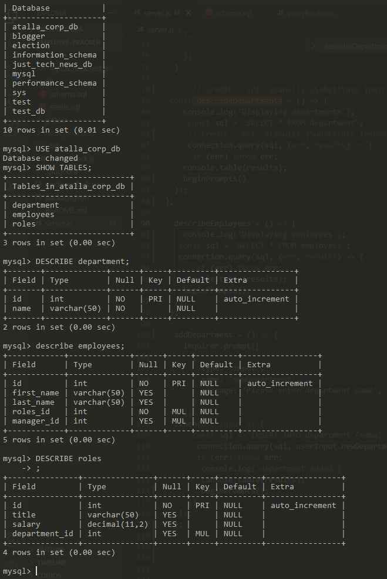

# Employee Tracker

  
    
  
   
  
   
  
   
  
   
  
  
  ## Description
  
   **AS the CEO of Atalla Corporation**
   I WANT to be able to view and manage the departments, roles, and employees in my company
   SO THAT I can organize and plan my business.

   GIVEN a command-line application that accepts user input
   WHEN I start the application
   THEN I am presented with the following options: view all departments, view all roles, view all employees, add a department, add a role, add an employee, and update an employee role
   WHEN I choose to view all departments
   THEN I am presented with a formatted table showing department names and department ids
   WHEN I choose to view all roles
   THEN I am presented with the job title, role id, the department that role belongs to, and the salary for that role
   WHEN I choose to view all employees
   THEN I am presented with a formatted table showing employee data, including employee ids, first names, last names, job titles, departments, salaries, and managers that the employees report to
   WHEN I choose to add a department
   THEN I am prompted to enter the name of the department and that department is added to the database
   WHEN I choose to add a role
   THEN I am prompted to enter the name, salary, and department for the role and that role is added to the database
   WHEN I choose to add an employee
   THEN I am prompted to enter the employee’s first name, last name, role, and manager and that employee is added to the database
   WHEN I choose to update an employee role
   THEN I am prompted to select an employee to update and their new role and this information is updated in the database

 
  ## Table of Contents
  - [Description](#description)
  - [Documentation](#documentation)
  - [Walkthrough](#walkthrough)
  - [Screenshot](#screenshot)
  - [Features](#features)
  - [Acknowledgements](#acknowledgements)
  - [License](#license)
  - [Contact](#contact)

  ## Documentation
  Inquirer.js <https://www.npmjs.com/package/inquirer>
   
  mysql2 <https://www.npmjs.com/package/mysql2>
 
  ## Walkthrough
  <https://drive.google.com/file/d/1YHF9vuEZUVFQZuCOevGi-TopP8cfYLGo/view>

  ## Screenshot
  
   
  

  ## Features
  100% command line interface, mysql2, inquirer.js
  
  # Acknowledgements
  Rob Atalla
   
  Nathan Szurek (tutor)
   
  Eric Stanulis (substitute instructor)
   
  stackoverflow <https://stackoverflow.com/questions/20692989/node-mysql-where-does-connection-end-go>
   
  mysqltutorial <https://www.mysqltutorial.org/mysql-nodejs/connect/>
   
  KU Coding Bootcamp, Module 12 Challenge Assignment © 2021 Trilogy Education Services, LLC, a 2U, Inc. brand Confidential and Proprietary. All Rights Reserved.
    
  ## License
  
   
  Permission to use this application is granted under the MIT license. <https://opensource.org/licenses/MIT>
  ## Contact:
  Holler at me! <a href="mailto:rob.atalla@robatalla816.com">rob.atalla@robatalla816.com</a>